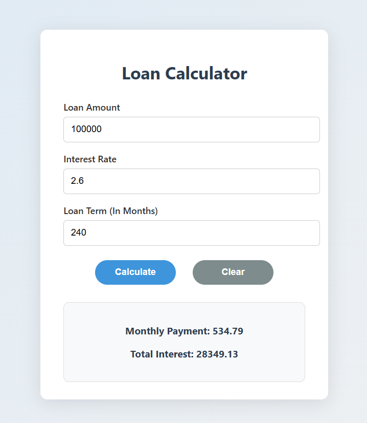

# Loan Calculator 🧮

A clean and responsive loan calculator built with HTML, CSS, and JavaScript.

## 🚀 Features
- Calculate monthly payments and total interest
- Reset form with a clear button
- Fully responsive and modern UI
- Vanilla JS only (no frameworks)

## 🖼️ Preview

## 🌐 Live Demo
[Open in GitHub Pages](https://KTsaneff.github.io/loan-calculator/)
